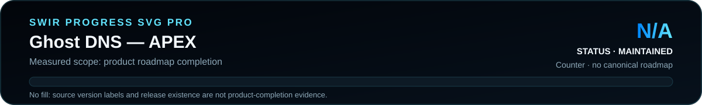

<!-- SWIR-README-STANDARD:v2 -->

<div align="center">


<br>


[](https://github.com/Swir)
[](https://github.com/Swir/Ghos-DNS/stargazers)

<br>

[**Highlights**](#-highlights) · [**Quick Start**](#-quick-start) · [**Usage**](#-usage--workflow) · [**Releases**](#-releases)

</div>

# Ghost DNS — APEX

A Windows desktop utility for inspecting, testing and changing DNS configuration from a CustomTkinter interface, with built-in provider profiles, local custom profiles and DHCP restore.

<p align="center">
  
</p>


## 📍 Project Status

<p align="center">
  
</p>

| Item | Status |
|---|---|
| Current stage | APEX v6.0 source utility |
| Platform | Windows 10 / 11 |
| Languages | English (`mainEnglish.py`) and Polish (`main.py`) |
| Public release | [DNS CHANGER by Swir](https://github.com/Swir/Ghos-DNS/releases/tag/DNS) |
| Product progress | **N/A** — no authoritative measurable roadmap exists |

## 🚀 Overview

Ghost DNS groups common DNS-changing tasks into one GUI. It detects the active Windows network adapter, reads the current DNS state, can probe preset server latency, applies a selected DNS pair, stores user-defined profiles in `custom_dns.json`, and restores automatic DHCP DNS configuration.

The repository intentionally keeps separate English and Polish application files. Changing system DNS requires administrator privileges; the application checks for elevation before enabling its normal workflow.

## ✨ Highlights

| Feature | What it does |
|---|---|
| ⚡ Profile switching | Applies a selected primary/secondary DNS pair from the GUI |
| 📡 Adapter detection | Finds the active Windows network interface before applying settings |
| 🧪 Latency probe | Measures reachability/latency for configured DNS server addresses |
| 🧭 Current DNS view | Displays the detected adapter and current DNS configuration |
| 🗂️ Built-in presets | Includes performance, security/privacy, filtering and DHCP groups |
| ➕ Custom profiles | Saves user-defined DNS entries locally in `custom_dns.json` |
| ♻️ DHCP restore | Returns DNS configuration to automatic assignment |
| 🌍 EN / PL variants | Ships separate English and Polish interfaces |
| 🌙 Desktop UI | Uses a dark CustomTkinter interface |

## ⚙️ Quick Start

```bash
git clone https://github.com/Swir/Ghos-DNS.git
cd Ghos-DNS
python -m pip install customtkinter
```

English interface:

```bash
python mainEnglish.py
```

Polish interface:

```bash
python main.py
```

Run the application with administrator privileges when you intend to change Windows DNS settings.

## 📋 Requirements / Compatibility

- Windows **10 / 11**
- Python **3.8+** as documented by the existing project
- `customtkinter`
- administrator privileges for system DNS changes
- network connectivity for meaningful external DNS/latency checks

No packaged installer or reproducible build workflow is present in the current source tree. Use the published ZIP only as the historical GitHub release asset and use the source instructions above for the current repository state.

## 🎮 Usage / Workflow

1. Start the English or Polish script with administrator privileges.
2. Review the detected adapter and current DNS information.
3. Refresh latency/status information if needed.
4. Select a built-in profile and apply it, or add your own primary/secondary IPv4 DNS addresses.
5. Use the automatic/DHCP profile to restore router/system-provided DNS settings.

Custom profiles are stored locally in `custom_dns.json` beside the running application. Back up that file if you want to preserve your personal profile list.

## 🧠 Technology / Architecture

| Layer | Technology / role |
|---|---|
| UI | CustomTkinter + Tkinter dialogs |
| Windows integration | `ctypes` elevation check and system command execution |
| Background work | Python threads for status/latency operations |
| User data | Local JSON custom-DNS profile file |
| Language variants | `mainEnglish.py` and `main.py` |

## 🗺️ Progress

<p align="center">
  
</p>

**Measured scope:** product-roadmap completion. **Result:** **N/A** because the repository has no canonical checklist or weighted roadmap. The `v6.0` source label and existence of a release are not converted into a made-up completion percentage.

## 📦 Releases

The repository currently has one public GitHub release named **DNS CHANGER by Swir** with the asset `Ghos.DNS.by.Swir.zip` and a recorded SHA-256 digest in GitHub release metadata.

[**Open GitHub Releases →**](https://github.com/Swir/Ghos-DNS/releases)

## ⚠️ Limitations / Responsible Use

- DNS changes modify system network configuration; record your previous settings or use DHCP restore if connectivity changes unexpectedly.
- Administrator privileges are required by the application before normal operation.
- Preset provider labels/descriptions are project data, not an independent guarantee of provider privacy, filtering behavior or real-world performance.
- Latency to a DNS server address is not the same thing as a full DNS-resolution benchmark.
- The project does not currently include automated CI, tests or a repository license file; do not describe unverified environments as tested and review repository terms before redistribution.

## 🔎 Search Keywords

`Windows DNS changer` • `DNS manager Windows 11` • `Python DNS utility` • `CustomTkinter network tool` • `DNS profile manager` • `DNS latency tester` • `change DNS Windows` • `custom DNS profiles` • `DHCP DNS restore` • `Windows network adapter DNS` • `Polish English DNS app` • `desktop DNS changer GUI`


<div align="center">

### `INSPECT • SWITCH • RESTORE • VERIFY`

⭐ **If this project is useful, consider leaving a star.**

[**← SWIR profile**](https://github.com/Swir) · [**All projects →**](https://github.com/Swir?tab=repositories)

</div>
